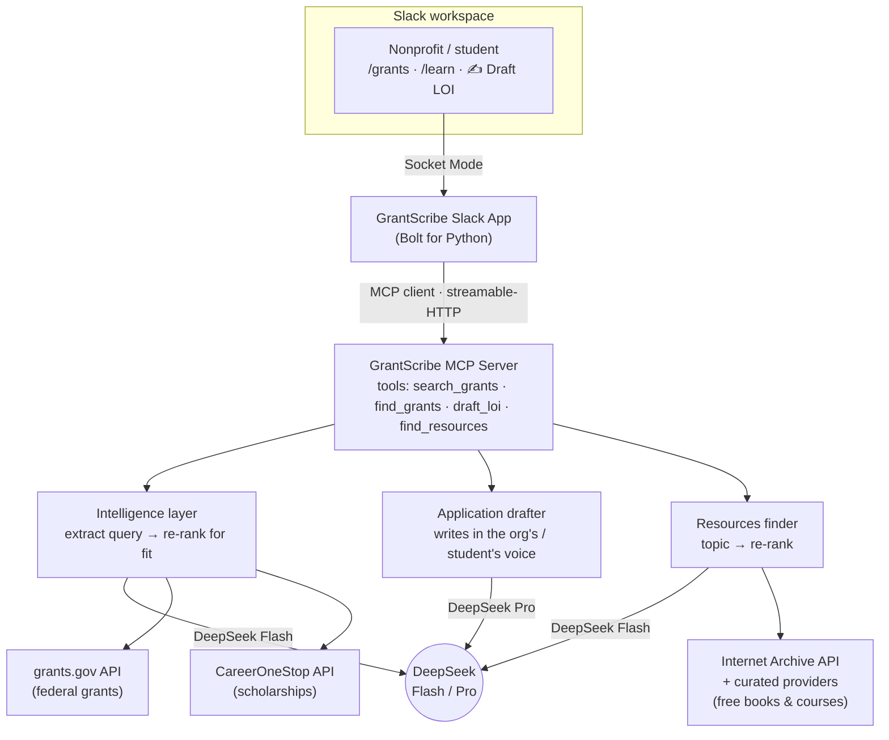

# GrantScribe — Architecture

**One line:** GrantScribe removes the money barrier to opportunity — inside Slack, it finds the
funding you qualify for and drafts the application in your own voice.

## Diagram (Mermaid — paste into mermaid.live to export a PNG for the submission)



## Plain-text view

```
 Slack user
   │  /grants · /learn · ✍️ Draft LOI            (Socket Mode)
   ▼
 GrantScribe Slack App (Bolt, Python)  ── slack_app.py
   │  calls tools as an MCP client     ── mcp_bridge.py (streamable-HTTP)
   ▼
 GrantScribe MCP Server  ── grants_server.py  (:8000/mcp)
   │   tools: search_grants · find_grants · draft_loi · find_resources
   ├── Intelligence (DeepSeek Flash): extract tight query → re-rank for true fit
   ├── Drafter (DeepSeek Pro): Letter of Intent / essay in the user's own voice
   └── Resources (DeepSeek Flash): learning goal → topic → re-rank
   │
   ├── grants_api      → grants.gov Search2 API        (nonprofit grants)   [LIVE]
   ├── scholarships    → CareerOneStop API             (student scholarships)[pending token]
   └── resources_api   → Internet Archive API + curated providers (free learning) [LIVE]
```

## How the required tech is load-bearing
- **MCP server integration (primary):** the agent's four capabilities live in a standalone MCP
  server. The Slack app is an MCP *client* — every action travels Slack → MCP bridge → MCP server →
  tool. Any MCP client (Claude, Slack's own MCP client, MCP Inspector) can reuse the same tools.
- **Slack AI capabilities:** delivered through the Slack agent/app surface (slash commands +
  interactive Block Kit cards + buttons), Socket Mode.

## Why it's smarter than the source websites
Raw grants.gov / Internet Archive keyword search returns hundreds of loosely-matched, often
expired or wrong-level results. GrantScribe's value is the pipeline around them:
**messy plain-language request → tight query → drop expired → re-rank for genuine fit (with a
reason) → draft the application in the user's own voice.** That last step — grounded in the user's
own prior report — is the moat: no generic tool or website can write in *your* voice from *your*
history.

## Three pillars, one engine
| Pillar | Audience | Data source | Draft step |
|---|---|---|---|
| Grants | Nonprofits | grants.gov | Letter of Intent in org's voice |
| Scholarships | Students | CareerOneStop | Application essay in student's voice |
| Free resources | Anyone | Internet Archive + curated | (none — surfaces what's free now) |

## Stack
Python · Slack Bolt (Socket Mode) · Model Context Protocol (FastMCP server + client) ·
DeepSeek V4 (Flash for extraction/ranking, Pro for drafting) · grants.gov · CareerOneStop ·
Internet Archive. Secrets in a git-ignored `.env`; no fabricated data, no silent fallbacks.
