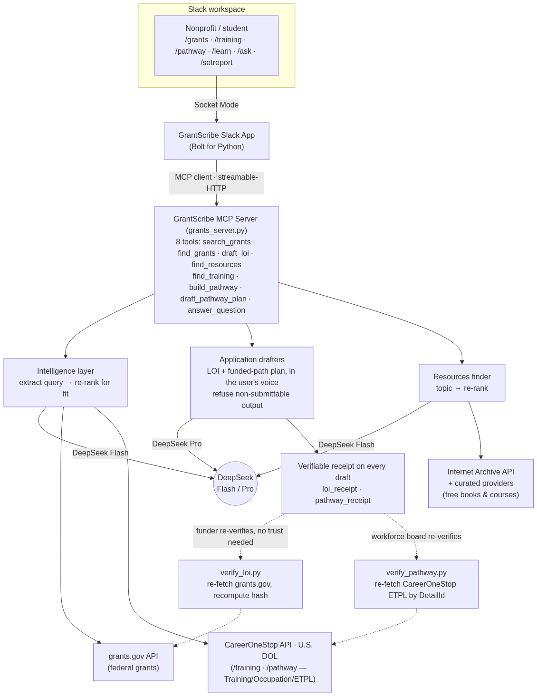
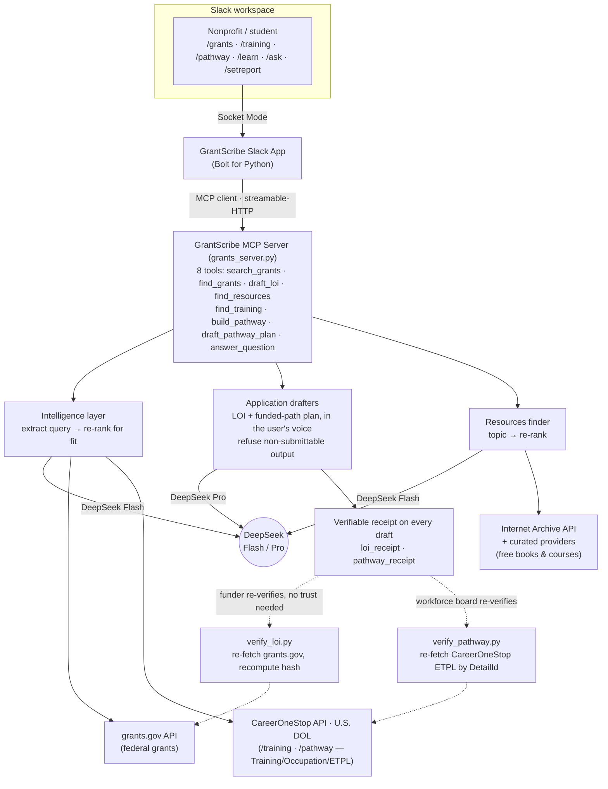

# GrantScribe — Architecture

**One line:** GrantScribe removes the money barrier to opportunity — inside Slack, it finds the
funding you qualify for and drafts the application in your own voice.

## Diagram



Source (Mermaid — edit and re-export with `mmdc -i src -o architecture.png` if the diagram changes):


```mermaid
flowchart TD
    subgraph SLACK["Slack workspace"]
        U["Nonprofit / student<br/>/grants · /training · /pathway · /learn · /ask · /setreport"]
    end

    U -->|Socket Mode| BOLT["GrantScribe Slack App<br/>(Bolt for Python)"]
    BOLT -->|MCP client · streamable-HTTP| MCP["GrantScribe MCP Server (grants_server.py)<br/>8 tools: search_grants · find_grants · draft_loi · find_resources<br/>find_training · build_pathway · draft_pathway_plan · answer_question"]

    MCP --> INTEL["Intelligence layer<br/>extract query → re-rank for fit"]
    MCP --> DRAFT["Application drafters<br/>LOI + funded-path plan, in the user's voice<br/>refuse non-submittable output"]
    MCP --> RESV["Resources finder<br/>topic → re-rank"]

    INTEL -->|DeepSeek Flash| LLM(("DeepSeek<br/>Flash / Pro"))
    DRAFT -->|DeepSeek Pro| LLM
    RESV -->|DeepSeek Flash| LLM

    INTEL --> GG["grants.gov API<br/>(federal grants)"]
    INTEL --> CO["CareerOneStop API · U.S. DOL<br/>(/training · /pathway — Training/Occupation/ETPL)"]
    RESV --> IA["Internet Archive API<br/>+ curated providers<br/>(free books & courses)"]

    DRAFT --> RCPT["Verifiable receipt on every draft<br/>loi_receipt · pathway_receipt"]
    RCPT -.->|funder re-verifies, no trust needed| VLOI["verify_loi.py<br/>re-fetch grants.gov, recompute hash"]
    RCPT -.->|workforce board re-verifies| VPATH["verify_pathway.py<br/>re-fetch CareerOneStop ETPL by DetailId"]
    VLOI -.-> GG
    VPATH -.-> CO
```

## Plain-text view

```
 Slack user
   │  /grants · /learn · ✍️ Draft LOI            (Socket Mode)
   ▼
 GrantScribe Slack App (Bolt, Python)  ── slack_app.py
   │  calls tools as an MCP client     ── mcp_bridge.py (streamable-HTTP)
   ▼
 GrantScribe MCP Server  ── grants_server.py  (:8000/mcp, or $FASTMCP_PORT)
   │   8 tools: search_grants · find_grants · draft_loi · find_resources · find_training · build_pathway · draft_pathway_plan · answer_question
   ├── Intelligence (DeepSeek Flash): extract tight query → re-rank for true fit
   ├── Drafter (DeepSeek Pro): Letter of Intent / essay in the user's own voice
   └── Resources (DeepSeek Flash): learning goal → topic → re-rank
   │
   ├── grants_api      → grants.gov Search2 API        (nonprofit grants)   [LIVE]
   ├── training_api    → CareerOneStop Training API    (/training: real accredited programs, U.S. DOL CareerOneStop)  [LIVE]
   ├── pathway_api     → CareerOneStop Occupation+Training via occupation_api + training_api (/pathway: goal job → credential → local ETPL programs; emits a second receipt re-verifiable by DetailId via verify_pathway.py)  [LIVE]
   └── resources_api   → Internet Archive API + curated providers (free learning) [LIVE]
```

## How the required tech is load-bearing
- **MCP server integration (primary):** the agent's capabilities live in a standalone MCP server as
  eight tools — `search_grants`, `find_grants`, `draft_loi`, `find_resources`, `find_training`,
  `build_pathway`, `draft_pathway_plan`, `answer_question` (grep `@mcp.tool()` in `grants_server.py`).
  The Slack app is an MCP *client* — every action travels Slack → MCP bridge → MCP server → tool. Any
  MCP client (Claude, Slack's own MCP client, MCP Inspector) can reuse the same tools.
- **Slack AI capabilities:** delivered through the Slack agent/app surface (slash commands +
  interactive Block Kit cards + buttons), Socket Mode.

## Why it's smarter than the source websites
Raw grants.gov / Internet Archive keyword search returns hundreds of loosely-matched, often
expired or wrong-level results. GrantScribe's value is the pipeline around them:
**messy plain-language request → tight query → drop expired → re-rank for genuine fit (with a
reason) → draft the application in the user's own voice → emit a receipt that re-verifies back to
the source.** The blank page was the barrier; we deleted the blank page. Then we did the thing no
generic tool or website does: we invented the receipt — a draft a funder can re-prove against
grants.gov or the DOL ETPL, grounded in the user's own prior report.

## Two pillars, two receipts — one engine
There is no free public scholarship API — CareerOneStop has none, and the others are paywalled or have no live host. So the second pillar is not a scholarship search. It is the real, live thing that removes the same money barrier: **/training** and **/pathway** run against the U.S. DOL CareerOneStop Training/Occupation APIs, and **/pathway** emits a second verifiable receipt — a funded-program plan a funder re-checks against the DOL ETPL by `DetailId` via `verify_pathway.py`. Two pillars, two receipts, one pattern: draft, then prove.

| Pillar | Audience | Data source | Draft step → proof |
|---|---|---|---|
| Grants | Nonprofits | grants.gov | Letter of Intent in org's voice → receipt re-verified to grants.gov by opportunity number (`verify_loi.py`) |
| Pathways to a credential & job | Students · jobseekers | CareerOneStop (DOL ETA / ETPL) | `/pathway` plan in the student's voice → receipt re-verified to the DOL ETPL by `DetailId` (`verify_pathway.py`); `/training` lists real accredited programs near you |
| Free resources | Anyone | Internet Archive + curated | (none — surfaces what's free now) |

`/scholarships` is an honest empty state: it names this finding and redirects to `/pathway`, `/training`, and `/grants`. The agent never invents a source it doesn't have.

## Stack
Python · Slack Bolt (Socket Mode) · Model Context Protocol (FastMCP server + client) ·
DeepSeek V4 (Flash for extraction/ranking, Pro for drafting) · grants.gov · CareerOneStop ·
Internet Archive. Secrets in a git-ignored `.env`; no fabricated data, no silent fallbacks.
